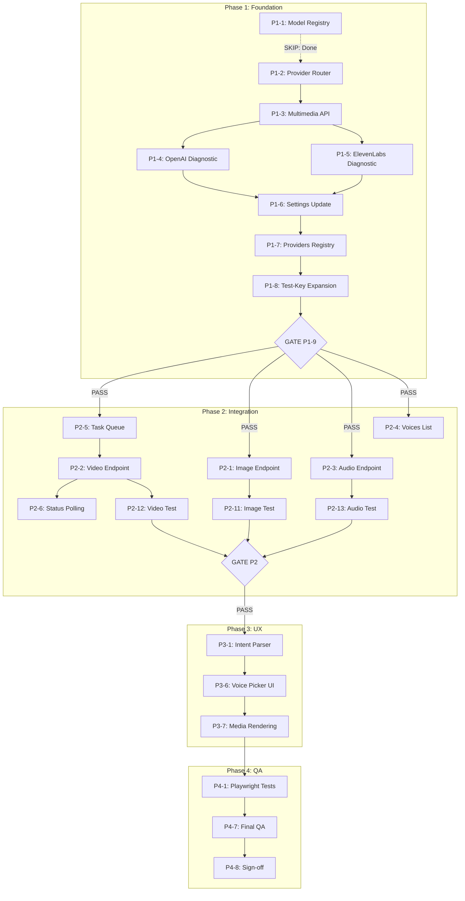

# DesktopGo.md — FloydDesktopWeb-v2 Multimedia Studio Execution Plan

**Created:** 2026-02-28 11:59:36 UTC  
**Updated:** 2026-02-28 20:05:00 UTC  
**Status:** PHASE 5 PENDING — Phases 1-4 COMPLETE  
**Target:** Complete Chat Integration for Natural Language Multimedia Generation  
**Timeline:** Week 9-10 (Phase 5)

---

## 🚨 NEXT AGENT DIRECTIVE

**READ THIS FIRST:** Phases 1-4 are COMPLETE. Your task is to execute **Phase 5: Chat Integration**.

**Phase 5 Goal:** Enable users to type "generate an image of a sunset" in chat and have the AI trigger generation automatically.

**Phase 5 Tasks (10 total):**
1. P5-1: Intent Parser (`server/src/intent-parser.ts`) — NEW FILE
2. P5-2: Parameter Extraction — EXTEND intent-parser.ts
3. P5-3: Confidence Threshold Logic — EXTEND intent-parser.ts
4. P5-4: Chat-to-Generation Router (`server/index.ts`) — NEW ENDPOINT
5. P5-5: Media Message Type (`src/types/index.ts`) — MODIFY
6. P5-6: Image Rendering (`src/components/ChatMessage.tsx`) — MODIFY
7. P5-7: Audio Player (`src/components/ChatMessage.tsx`) — MODIFY
8. P5-8: Video Player (`src/components/ChatMessage.tsx`) — MODIFY
9. P5-9: Generation Progress SSE (`server/index.ts`) — NEW ENDPOINT
10. P5-10: Integration Test — MANUAL

**Start with P5-1 (Intent Parser). Follow the 7-step verification protocol.**

---

## ⚠️ CRITICAL CONSTRAINT: NO SUB-AGENTS

**Confirmed Issue:** The Agent tool FREEZES and Escape key CANNOT interrupt.

| Problem | Status |
|---------|--------|
| Agent tool freezes | ✅ CONFIRMED |
| Escape key cannot break turn | ✅ CONFIRMED |
| Sub-agents are usable | ❌ **UNSAFE - DO NOT USE** |

**Solution:** This plan uses **SINGLE-AGENT ONLY** with **Direct Tool Chaining**.

### Allowed Tools (Safe)
```
✅ Glob      - File pattern matching
✅ Grep      - Content search
✅ View      - Read files
✅ Edit      - Modify files
✅ Write     - Create files
✅ Bash      - Execute commands
✅ LS        - Directory listing
✅ Parallel_Bash - Run up to 4 independent commands
```

### Forbidden Tools (Unsafe)
```
❌ Agent     - Freezes, cannot interrupt
❌ Workflow  - Uses agents internally
❌ Any MCP tool that spawns agents
```

---

## Execution Methodology: Single-Agent Sequential

### ⚠️ MANDATORY VERIFICATION CHECKLIST (Enforceable)

**Every task MUST complete ALL 7 steps before proceeding. No exceptions.**

```
┌─────────────────────────────────────────────────────────────────────────────┐
│                    TASK VERIFICATION PROTOCOL v1.0                          │
├─────────────────────────────────────────────────────────────────────────────┤
│  STEP 1: VIEW REFERENCE                                                     │
│          □ View similar existing files for patterns/imports                 │
│          Evidence: [list files viewed]                                      │
│                                                                             │
│  STEP 2: WRITE/EDIT TARGET                                                  │
│          □ Create or modify target file                                     │
│          Evidence: [tool confirmation]                                      │
│                                                                             │
│  STEP 3: VERIFY CONTENT INTEGRITY                                           │
│          □ View target file to confirm content was written correctly        │
│          Evidence: [line count, key exports present]                        │
│                                                                             │
│  STEP 4: COMPILE IN ISOLATION                                               │
│          □ npx tsc <file> --noEmit [flags]                                  │
│          Evidence: [exit code 0, no errors]                                 │
│                                                                             │
│  STEP 5: IMPORT INTEGRATION TEST                                            │
│          □ node --eval "import('./path').then(m => console.log(Object.keys(m)))" │
│          Evidence: [exports listed, no errors]                              │
│                                                                             │
│  STEP 6: REPORT WITH EVIDENCE                                               │
│          □ Summarize: file path, size, line count, key exports              │
│          Evidence: [structured report]                                      │
│                                                                             │
│  STEP 7: USER ACKNOWLEDGMENT                                                │
│          □ Wait for explicit user confirmation before next task             │
│          Evidence: [user said "yes", "continue", or "proceed"]              │
└─────────────────────────────────────────────────────────────────────────────┘
```

**FAILURE HANDLING:**
- If any step fails: STOP, diagnose, fix, re-run from failed step
- After 2 failures on same step: ESCALATE to user with 3 alternatives
- NEVER proceed to next task with unverified work

---

### Pattern A: File Creation (Enhanced)
```
1. VIEW reference files for patterns
2. WRITE new file with Write tool
3. VIEW target file to confirm content integrity
4. COMPILE target file in isolation (tsc --noEmit)
5. TEST import integration (node --eval import)
6. REPORT with evidence (size, lines, exports)
7. WAIT for user acknowledgment
```

### Pattern B: File Modification (Enhanced)
```
1. VIEW target file to understand current state
2. PLAN exact edit with line numbers
3. APPLY edit with Edit tool
4. VIEW target file to confirm modification
5. VERIFY with Bash (curl test or tsc)
6. REPORT with evidence
7. WAIT for user acknowledgment
```

### Pattern C: Parallel Commands (Safe)
```
Use parallel_bash for up to 4 INDEPENDENT read-only commands:
- git status
- file listings
- health checks
- grep searches

NOTE: Parallel commands do NOT require the 7-step checklist
      as they are read-only and do not modify state.
```

### Checkpoint System
```
Every 2-3 tasks: Ask user to confirm "Ready for next batch?"
At phase gates: Full verification, user must approve continuation
```

---

## Current State Assessment

**Last Updated:** 2026-02-28 14:50:00 UTC  
**Current Phase:** Phase 2 (Phase 1 COMPLETE ✅, TypeScript Clean ✅)

### Phase 1 Completion Summary (2026-02-28)

| Task | Description | Status | File/Endpoint |
|------|-------------|--------|---------------|
| P1-1 | Model Registry | ✅ COMPLETE | `server/src/model-registry.ts` |
| P1-2 | Provider Router | ✅ COMPLETE | `server/src/provider-router.ts` |
| P1-3 | Multimedia API Handler | ✅ COMPLETE | `server/src/multimedia-api.ts` |
| P1-4 | OpenAI Image Diagnostic | ✅ COMPLETE | `/api/diagnostic/openai-image` |
| P1-5 | ElevenLabs Audio Diagnostic | ✅ COMPLETE | `/api/diagnostic/elevenlabs` |
| P1-6 | Settings API Keys | ✅ COMPLETE | Settings interface |
| P1-7 | Providers multimediaModels | ✅ COMPLETE | `/api/providers` |
| P1-8 | Test-Key Expansion | ✅ COMPLETE | `/api/test-key` |
| P1-9 | VERIFICATION GATE | ✅ PASSED | All endpoints verified |

### Already Completed ✅

| Component | Status | Location |
|-----------|--------|----------|
| Model Registry | ✅ COMPLETE | `server/src/model-registry.ts` |
| MCP Integration | ✅ COMPLETE | 12 MCP servers configured |
| OpenAI SDK | ✅ INSTALLED | v6.16.0 in package.json |
| Express Server | ✅ RUNNING | `server/index.ts` |
| File Upload | ✅ WORKING | multer middleware configured |
| Session Management | ✅ WORKING | In-memory Map storage |

### Gap Analysis — What's Missing (Updated for Phase 2)

| Component | Phase | Priority | Notes |
|-----------|-------|----------|-------|
| Task Queue | P2 | HIGH | DO FIRST in Phase 2 |
| Image Generation Endpoint | P2 | HIGH | POST /api/generate/image |
| Video Generation Endpoint | P2 | HIGH | POST /api/generate/video (async) |
| Audio Generation Endpoint | P2 | HIGH | POST /api/generate/audio |
| Voices List Endpoint | P2 | MEDIUM | GET /api/voices |
| Task Status Polling | P2 | MEDIUM | GET /api/generate/status/:taskId |
| Intent Parser | P3 | MEDIUM | Natural language routing |
| Voice Picker UI | P3 | MEDIUM | React component |
| Playwright Tests | P4 | LOW | E2E testing |

---

## Native Tool Inventory (Safe to Use)

### Primary Tools for Refactor

```
┌─────────────────────────────────┬─────────────────────────────────────────────┐
│ Tool                            │ Use Case                                    │
├─────────────────────────────────┼─────────────────────────────────────────────┤
│ Write                           │ Create new files (server/src/*.ts)          │
│ Edit                            │ Modify existing files (server/index.ts)     │
│ View                            │ Read files for reference                    │
│ Glob                            │ Find files by pattern (*.ts, *.tsx)         │
│ Grep                            │ Search file contents                        │
│ LS                              │ Directory structure exploration             │
│ Bash                            │ npm run, tsc, curl tests                    │
│ Parallel_Bash                   │ Up to 4 independent commands at once        │
│ Multiedit                       │ Multiple edits to same file                 │
└─────────────────────────────────┴─────────────────────────────────────────────┘
```

### MCP Servers (AVOID - May Spawn Agents)

```
⚠️ The following MCP servers are available but should NOT be used during
   this refactor due to potential sub-agent spawning:

❌ hivemind-v2        - Multi-agent coordination (uses agents)
❌ omega-v2           - Meta-cognition (may spawn agents)
❌ lab-lead-server    - Agent spawning capability
❌ context-singularity-v2 - Mode shifts may trigger agents
❌ pattern-crystallizer-v2 - May use agents for analysis

✅ The refactor will use ONLY native FLOYD tools listed above.
```

---

## Phase 1: Foundation Infrastructure (Weeks 1-2)

### Execution Strategy: SEQUENTIAL WITH USER CHECKPOINTS

**Batch Size:** 2-3 tasks per turn, then pause for user confirmation

---

### P1-1: Provider Router Class ✅ SKIP — Already Exists

**Status:** Model Registry already implemented at `server/src/model-registry.ts`

**Action:** Verify completeness, move to P1-2

---

### P1-2: Build Provider Router Class

**Status:** PENDING  
**File:** `server/src/provider-router.ts` (NEW)  
**Estimated Time:** 1 hour

**🔧 EXECUTION PATTERN: Direct File Creation**

```
Step 1: View existing model-registry.ts for import patterns
Step 2: Write new file with Write tool
Step 3: Verify with Bash: npx tsc server/src/provider-router.ts --noEmit
Step 4: Report completion, wait for user ack
```

**📋 Implementation:**

```typescript
// server/src/provider-router.ts
import { ModelCapability, ModelType, getModelById, getModelsByType } from './model-registry.js';

export interface RoutingRequirements {
  format?: string;
  quality?: 'fast' | 'balanced' | 'high';
  costOptimized?: boolean;
}

export class ProviderRouter {
  private defaultModels: Map<ModelType, string> = new Map([
    ['image-generation', 'dall-e-3'],
    ['video-generation', 'cogvideox-3'],
    ['audio-generation', 'eleven_multilingual_v2'],
    ['vision', 'glm-4.6v'],
    ['language', 'glm-5'],
  ]);

  selectOptimalModel(
    taskType: ModelType,
    requirements?: RoutingRequirements
  ): ModelCapability {
    const candidates = getModelsByType(taskType);
    
    if (candidates.length === 0) {
      throw new Error(`No models available for type: ${taskType}`);
    }

    let filtered = candidates;
    if (requirements?.format) {
      filtered = candidates.filter(m => 
        m.supportedFormats?.includes(requirements.format!)
      );
      if (filtered.length === 0) filtered = candidates;
    }

    if (requirements?.quality === 'high') {
      return filtered.sort((a, b) => (b.maxTokens || 0) - (a.maxTokens || 0))[0];
    }
    
    if (requirements?.quality === 'fast') {
      return filtered.sort((a, b) => 
        (a.pricing?.perRequest || 0) - (b.pricing?.perRequest || 0)
      )[0];
    }

    const defaultId = this.defaultModels.get(taskType);
    if (defaultId) {
      const defaultModel = getModelById(defaultId);
      if (defaultModel) return defaultModel;
    }

    return filtered[0];
  }

  setDefaultModel(type: ModelType, modelId: string): void {
    this.defaultModels.set(type, modelId);
  }

  getDefaultModel(type: ModelType): string | undefined {
    return this.defaultModels.get(type);
  }
}

export const providerRouter = new ProviderRouter();
```

**✅ Verification:**

```bash
npx tsc server/src/provider-router.ts --noEmit
# Expected: No errors
```

---

### P1-3: Implement MultimediaAPIHandler Class

**Status:** PENDING  
**File:** `server/src/multimedia-api.ts` (NEW)  
**Estimated Time:** 2 hours

**🔧 EXECUTION PATTERN: Direct File Creation**

```
Step 1: View package.json to confirm OpenAI SDK is available
Step 2: View model-registry.ts for import patterns
Step 3: Write new file with Write tool
Step 4: Verify with Bash: npx tsc server/src/multimedia-api.ts --noEmit
Step 5: Report completion, wait for user ack
```

**⚠️ CHECKPOINT:** After P1-2 and P1-3, pause for user confirmation before proceeding.

**📋 Implementation:**

```typescript
// server/src/multimedia-api.ts
import OpenAI from 'openai';
import { ModelCapability, getModelById } from './model-registry.js';
import { providerRouter, RoutingRequirements } from './provider-router.js';

export interface GenerationOptions {
  format?: string;
  dimensions?: { width: number; height: number };
  duration?: 5 | 10;
  fps?: 30 | 60;
  voice?: string;
  quality?: 'low' | 'medium' | 'high';
  withAudio?: boolean;
}

export interface GenerationResult {
  success: boolean;
  data?: string; // Base64 or URL
  taskId?: string; // For async operations
  metadata?: {
    model: string;
    format?: string;
    size?: string;
    duration?: number;
    generationTime?: number;
  };
  error?: string;
}

export class MultimediaAPIHandler {
  private openaiClient: OpenAI | null = null;
  private zaiApiKey: string | null = null;
  private elevenLabsApiKey: string | null = null;

  configure(settings: {
    openaiApiKey?: string;
    zaiApiKey?: string;
    elevenLabsApiKey?: string;
  }): void {
    if (settings.openaiApiKey) {
      this.openaiClient = new OpenAI({ apiKey: settings.openaiApiKey });
    }
    this.zaiApiKey = settings.zaiApiKey || null;
    this.elevenLabsApiKey = settings.elevenLabsApiKey || null;
  }

  async generateImage(
    prompt: string,
    options?: GenerationOptions
  ): Promise<GenerationResult> {
    if (!this.openaiClient) {
      return { success: false, error: 'OpenAI API key not configured' };
    }

    const startTime = Date.now();
    
    try {
      const response = await this.openaiClient.images.generate({
        model: 'dall-e-3',
        prompt,
        size: options?.dimensions 
          ? `${options.dimensions.width}x${options.dimensions.height}` as any
          : '1024x1024',
        quality: options?.quality === 'high' ? 'hd' : 'standard',
        n: 1,
        response_format: 'b64_json',
      });

      const image = response.data[0];
      
      return {
        success: true,
        data: image.b64_json,
        metadata: {
          model: 'dall-e-3',
          format: options?.format || 'png',
          generationTime: Date.now() - startTime,
        }
      };
    } catch (error: any) {
      return { success: false, error: error.message };
    }
  }

  async generateVideo(
    prompt: string,
    options?: GenerationOptions,
    imageUrl?: string
  ): Promise<GenerationResult> {
    if (!this.zaiApiKey) {
      return { success: false, error: 'Zai API key not configured' };
    }

    const startTime = Date.now();

    try {
      const body: any = {
        model: 'cogvideox-3',
        prompt,
        quality: options?.quality === 'high' ? 'quality' : 'speed',
        with_audio: options?.withAudio ?? false,
        size: options?.dimensions 
          ? `${options.dimensions.width}x${options.dimensions.height}`
          : '1920x1080',
        fps: options?.fps || 30,
        duration: options?.duration || 5,
      };

      if (imageUrl) {
        body.image_url = [imageUrl];
      }

      const response = await fetch('https://open.bigmodel.cn/api/paas/v4/videos/generations', {
        method: 'POST',
        headers: {
          'Authorization': `Bearer ${this.zaiApiKey}`,
          'Content-Type': 'application/json',
        },
        body: JSON.stringify(body),
      });

      const data = await response.json();

      if (data.task_status === 'FAIL') {
        return { success: false, error: 'Video generation failed' };
      }

      return {
        success: true,
        taskId: data.id,
        metadata: {
          model: 'cogvideox-3',
          generationTime: Date.now() - startTime,
        }
      };
    } catch (error: any) {
      return { success: false, error: error.message };
    }
  }

  async getVideoResult(taskId: string): Promise<GenerationResult> {
    if (!this.zaiApiKey) {
      return { success: false, error: 'Zai API key not configured' };
    }

    try {
      const response = await fetch(`https://open.bigmodel.cn/api/paas/v4/async-result/${taskId}`, {
        headers: {
          'Authorization': `Bearer ${this.zaiApiKey}`,
        },
      });

      const data = await response.json();

      if (data.task_status === 'PROCESSING') {
        return { success: true, taskId, metadata: { model: 'cogvideox-3' } };
      }

      if (data.task_status === 'SUCCESS' && data.video_result?.[0]?.url) {
        const videoResponse = await fetch(data.video_result[0].url);
        const videoBuffer = await videoResponse.arrayBuffer();
        const videoBase64 = Buffer.from(videoBuffer).toString('base64');

        return {
          success: true,
          data: videoBase64,
          metadata: {
            model: 'cogvideox-3',
            format: 'mp4',
          }
        };
      }

      return { success: false, error: 'Video generation failed' };
    } catch (error: any) {
      return { success: false, error: error.message };
    }
  }

  async generateAudio(
    text: string,
    voiceId: string,
    options?: GenerationOptions
  ): Promise<GenerationResult> {
    if (!this.elevenLabsApiKey) {
      return { success: false, error: 'ElevenLabs API key not configured' };
    }

    const startTime = Date.now();

    try {
      const response = await fetch(`https://api.elevenlabs.io/v1/text-to-speech/${voiceId}`, {
        method: 'POST',
        headers: {
          'xi-api-key': this.elevenLabsApiKey,
          'Content-Type': 'application/json',
        },
        body: JSON.stringify({
          text,
          model_id: 'eleven_multilingual_v2',
          output_format: 'mp3_44100_128',
        }),
      });

      if (!response.ok) {
        const error = await response.json();
        return { success: false, error: error.message || 'Audio generation failed' };
      }

      const audioBuffer = await response.arrayBuffer();
      const audioBase64 = Buffer.from(audioBuffer).toString('base64');

      return {
        success: true,
        data: audioBase64,
        metadata: {
          model: 'eleven_multilingual_v2',
          format: 'mp3',
          generationTime: Date.now() - startTime,
        }
      };
    } catch (error: any) {
      return { success: false, error: error.message };
    }
  }

  async getVoices(): Promise<{ id: string; name: string }[]> {
    if (!this.elevenLabsApiKey) {
      return [];
    }

    try {
      const response = await fetch('https://api.elevenlabs.io/v1/voices', {
        headers: {
          'xi-api-key': this.elevenLabsApiKey,
        },
      });

      const data = await response.json();
      return data.voices?.map((v: any) => ({ id: v.voice_id, name: v.name })) || [];
    } catch {
      return [];
    }
  }
}

export const multimediaAPI = new MultimediaAPIHandler();
```

**✅ Verification:**

```bash
npx tsc server/src/multimedia-api.ts --noEmit
# Expected: No errors
```

---

### P1-4 through P1-8: Server Endpoint Modifications

**Status:** PENDING  
**File:** `server/index.ts` (MODIFY)  
**Estimated Time:** 2 hours total

**🔧 EXECUTION PATTERN: Sequential Edits**

```
Step 1: View current server/index.ts to find insertion points
Step 2: Add P1-4 (OpenAI Diagnostic) with Edit tool
Step 3: Verify server starts: npm run dev:server (background)
Step 4: Test endpoint: curl http://localhost:3001/api/diagnostic/openai-image
Step 5: Repeat for P1-5, P1-6, P1-7, P1-8
Step 6: Report after each 2 edits, wait for user ack
```

**⚠️ BACKUP:** Copy server/index.ts before modifications

| Task | Endpoint/Change | Verification |
|------|-----------------|--------------|
| P1-4 | Add `/api/diagnostic/openai-image` | curl returns JSON |
| P1-5 | Add `/api/diagnostic/elevenlabs` | curl returns JSON |
| P1-6 | Settings: add openaiApiKey, elevenLabsApiKey | Settings persist |
| P1-7 | Providers: add multimediaModels | Response includes DALL-E |
| P1-8 | Test-Key: add openai-image, elevenlabs | Key validation works |

---

### P1-9: VERIFICATION GATE 🚨

**Status:** MUST PASS BEFORE PHASE 2

**🔧 EXECUTION PATTERN: Parallel Bash + Sequential Tests**

```
Step 1: Run TypeScript compilation
        Bash: npx tsc --noEmit
        
Step 2: Start server in background
        Bash: npm run dev:server &
        
Step 3: Test existing endpoints (use parallel_bash for speed)
        - curl /api/health
        - curl /api/settings
        - curl /api/providers
        - curl /api/sessions
        
Step 4: Test new endpoints
        - curl /api/diagnostic/openai-image
        - curl /api/diagnostic/elevenlabs
        
Step 5: Report all results, wait for user approval to proceed
```

**✅ Gate Pass Criteria:**
- All TypeScript compiles without errors
- All 71 existing endpoints return 200
- New diagnostic endpoints return JSON
- Server starts without crashes

**📋 Verification Script:**

```bash
#!/bin/bash
# P1-9 Verification Gate

echo "=== PHASE 1 VERIFICATION GATE ==="

# 1. TypeScript compilation
echo "1. TypeScript compilation..."
npx tsc --noEmit || { echo "FAILED: TypeScript errors"; exit 1; }

# 2. Server startup
echo "2. Starting server..."
timeout 10 npm run dev:server &
sleep 5

# 3. Existing endpoints
echo "3. Testing existing endpoints..."
endpoints=(
  "/api/health"
  "/api/health/extended"
  "/api/settings"
  "/api/providers"
  "/api/skills"
  "/api/projects"
  "/api/sessions"
  "/api/diagnostic/glm-vision"
)

for endpoint in "${endpoints[@]}"; do
  status=$(curl -s -o /dev/null -w "%{http_code}" "http://localhost:3001$endpoint")
  if [ "$status" != "200" ]; then
    echo "FAILED: $endpoint returned $status"
    exit 1
  fi
  echo "  ✓ $endpoint"
done

# 4. New endpoints
echo "4. Testing new endpoints..."
curl -s "http://localhost:3001/api/diagnostic/openai-image" | jq '.timestamp'
curl -s "http://localhost:3001/api/diagnostic/elevenlabs" | jq '.timestamp'

# 5. Cleanup
pkill -f "tsx watch server/index.ts"

echo "=== PHASE 1 VERIFICATION COMPLETE ==="
```

---

## Phase 2: Core Provider Integration (Weeks 3-4)

### Execution Strategy: SEQUENTIAL WITH TASK DEPENDENCIES

**⚠️ NOTE:** No parallel execution via agents. Tasks run one at a time.

---

### P2-1: Image Generation Endpoint

**Status:** PENDING  
**File:** `server/index.ts` (ADD)  
**Dependencies:** P1-9 ✅

**🔧 EXECUTION PATTERN:**

```
Step 1: View server/index.ts to find endpoint insertion point
Step 2: Add POST /api/generate/image with Edit tool
Step 3: Import multimediaAPI at top of file
Step 4: Verify: npx tsc --noEmit
Step 5: Test: curl -X POST http://localhost:3001/api/generate/image
Step 6: Report, wait for user ack
```

---

### P2-2: Video Generation Endpoint (Async)

**Status:** PENDING  
**File:** `server/index.ts` (ADD)  
**Dependencies:** P1-9 ✅, P2-5 (Task Queue) ← **DO THIS AFTER P2-5**

---

### P2-3: Audio Generation Endpoint

**Status:** PENDING  
**File:** `server/index.ts` (ADD)  
**Dependencies:** P1-9 ✅

**🔧 EXECUTION PATTERN:** Same as P2-1

---

### P2-4: Voices List Endpoint

**Status:** PENDING  
**File:** `server/index.ts` (ADD)  
**Dependencies:** P1-9 ✅

**🔧 EXECUTION PATTERN:** Same as P2-1

---

### P2-5: Build Task Queue (CRITICAL - DO FIRST IN PHASE 2)

**Status:** PENDING  
**File:** `server/src/task-queue.ts` (NEW)  
**Dependencies:** None

**🔧 EXECUTION PATTERN:**

```
Step 1: Write server/src/task-queue.ts with Write tool
Step 2: Verify: npx tsc server/src/task-queue.ts --noEmit
Step 3: Import in server/index.ts with Edit tool
Step 4: Report, wait for user ack
```

**📋 Implementation:**

```typescript
// server/src/task-queue.ts
import { v4 as uuidv4 } from 'uuid';

export type TaskStatus = 'pending' | 'processing' | 'completed' | 'failed';

export interface Task {
  id: string;
  type: 'video-generation' | 'image-generation';
  status: TaskStatus;
  createdAt: number;
  completedAt?: number;
  result?: any;
  error?: string;
  sessionId: string;
  prompt: string;
}

class TaskQueue {
  private tasks: Map<string, Task> = new Map();
  private maxSize: number = 100;

  createTask(type: Task['type'], sessionId: string, prompt: string): string {
    const id = uuidv4();
    const task: Task = {
      id,
      type,
      status: 'pending',
      createdAt: Date.now(),
      sessionId,
      prompt
    };
    
    this.tasks.set(id, task);
    this.pruneOldTasks();
    
    return id;
  }

  updateTask(id: string, updates: Partial<Task>): void {
    const task = this.tasks.get(id);
    if (task) {
      this.tasks.set(id, { ...task, ...updates });
    }
  }

  getTask(id: string): Task | undefined {
    return this.tasks.get(id);
  }

  getTasksBySession(sessionId: string): Task[] {
    return Array.from(this.tasks.values())
      .filter(t => t.sessionId === sessionId)
      .sort((a, b) => b.createdAt - a.createdAt);
  }

  private pruneOldTasks(): void {
    if (this.tasks.size > this.maxSize) {
      const entries = Array.from(this.tasks.entries())
        .sort((a, b) => b[1].createdAt - a[1].createdAt);
      
      this.tasks.clear();
      entries.slice(0, this.maxSize).forEach(([k, v]) => this.tasks.set(k, v));
    }
  }
}

export const taskQueue = new TaskQueue();
```

---

### P2-6: Task Status Polling Endpoint

**Status:** PENDING  
**File:** `server/index.ts` (ADD)  
**Dependencies:** P2-2, P2-5 ✅

---

### P2-11, P2-12, P2-13: Manual Tests

**🔧 OPTIMAL TOOLS:**

| Test | Tool | Purpose |
|------|------|---------|
| P2-11 (Image) | `floyd-terminal-server` | curl POST /api/generate/image |
| P2-12 (Video) | `floyd-terminal-server` | curl POST /api/generate/video + polling |
| P2-13 (Audio) | `floyd-terminal-server` | curl POST /api/generate/audio |

---

## Phase 3: Frontend Multimedia Panel (Weeks 5-6) — ✅ COMPLETE

### Execution Strategy: SEQUENTIAL WITH USER CHECKPOINTS

---

### Phase 3 Task Order (Sequential)

```
P3-1: Multimedia API Hook Methods (src/hooks/useApi.ts) ← MODIFIED
P3-2: MultimediaPanel Component (src/components/MultimediaPanel.tsx) ← NEW FILE
P3-3: Image Generation Tab (in MultimediaPanel)
P3-4: Audio Generation Tab (in MultimediaPanel)
P3-5: Video Generation Tab (in MultimediaPanel)
P3-6: App Integration (src/App.tsx) ← MODIFIED
P3-7: Integration Tests
```

**Status:** ✅ COMPLETE (2026-02-28)

**What was built:**
- Standalone MultimediaPanel accessible via sidebar button
- Image, Audio, Video generation in dedicated modal
- NOT integrated with chat interface

---

## Phase 4: Testing & Polish (Weeks 7-8) — ✅ COMPLETE

### Execution Strategy: AUTOMATED TESTING

---

### Phase 4 Task Order (Sequential)

```
P4-1: Image Generation Test (real API call)
P4-2: Audio Generation Test (real API call)
P4-3: Video Generation Test (real API call + polling)
P4-4: Error Message Polish (server/index.ts)
P4-5: Graceful Degradation (MultimediaPanel.tsx)
P4-6: API Documentation (docs/api/multimedia-api.md)
P4-7: Final QA Regression Tests
```

**Status:** ✅ COMPLETE (2026-02-28)

**What was built:**
- All 3 generation endpoints tested with real API calls
- Enhanced error messages with hints
- Loading states, cancel buttons, retry logic
- Complete API documentation

---

## Phase 5: Chat Integration (Weeks 9-10) — PENDING

### Goal: Enable natural language multimedia generation from chat interface

**Current State:** Users must click the Image icon and use the dedicated panel.  
**Target State:** Users can type "generate an image of a sunset" in chat and AI triggers generation.

---

### Execution Strategy: SEQUENTIAL WITH USER CHECKPOINTS

**Batch Size:** 2-3 tasks per turn, then pause for user confirmation

---

### Phase 5 Task Order (Sequential)

| Task | Description | Dependencies | Est. Time |
|------|-------------|--------------|-----------|
| P5-1 | Intent Parser | None | 2 hours |
| P5-2 | Parameter Extraction | P5-1 | 1 hour |
| P5-3 | Confidence Threshold Logic | P5-2 | 1 hour |
| P5-4 | Chat-to-Generation Router | P5-3 | 2 hours |
| P5-5 | Media Message Type | P5-4 | 30 min |
| P5-6 | Image Rendering in ChatMessage | P5-5 | 1 hour |
| P5-7 | Audio Player in ChatMessage | P5-6 | 1 hour |
| P5-8 | Video Player in ChatMessage | P5-7 | 1.5 hours |
| P5-9 | Generation Progress SSE Events | P5-4 | 1.5 hours |
| P5-10 | Integration Test | P5-9 | 30 min |

---

### P5-1: Intent Parser

**Status:** PENDING  
**File:** `server/src/intent-parser.ts` (NEW)  
**Estimated Time:** 2 hours

**Description:** Parse natural language to determine media generation intent.

**Implementation:**
```typescript
// server/src/intent-parser.ts
export type MediaIntent = 
  | 'generate-image' 
  | 'generate-audio' 
  | 'generate-video' 
  | 'unknown';

export interface ParsedIntent {
  intent: MediaIntent;
  confidence: number; // 0-1
  mediaType?: 'image' | 'audio' | 'video';
  parameters: {
    prompt?: string;
    text?: string;
    voiceId?: string;
    voiceName?: string;
    duration?: 5 | 10;
    quality?: 'standard' | 'hd' | 'speed' | 'quality';
  };
  clarifyingQuestion?: string;
}

export function parseIntent(userMessage: string): ParsedIntent {
  // Detect patterns like:
  // "generate an image of..."
  // "create a picture showing..."
  // "make a video of..."
  // "say the following in Sarah's voice..."
  // "read this text aloud..."
}
```

**Pattern Matching Rules:**

| Pattern | Intent | Example |
|---------|--------|---------|
| `generate/create/make` + `image/picture/art` | generate-image | "generate an image of a sunset" |
| `generate/create/make` + `video/clip` | generate-video | "make a 5 second video of waves" |
| `say/speak/read` + `voice/aloud` | generate-audio | "say hello in Sarah's voice" |
| `generate` + `audio/speech` | generate-audio | "generate audio of welcome" |

**Verification:**
```bash
npx tsc server/src/intent-parser.ts --noEmit
node -e "
const { parseIntent } = './server/src/intent-parser.js';
console.log(parseIntent('generate an image of a sunset'));
// Expected: { intent: 'generate-image', confidence: 0.95, parameters: { prompt: 'a sunset' } }
"
```

---

### P5-2: Parameter Extraction

**Status:** PENDING  
**File:** `server/src/intent-parser.ts` (EXTEND)  
**Estimated Time:** 1 hour

**Description:** Extract parameters from user message.

**Extraction Logic:**

| Parameter | Extraction Method | Example |
|-----------|-------------------|---------|
| Image Prompt | Everything after "image of/picture of" | "image of **a sunset**" |
| Video Prompt | Everything after "video of" | "video of **ocean waves**" |
| Audio Text | Everything after "say/speak" | "say **hello world**" |
| Voice Name | Look for known voice names | "in **Sarah's** voice" |
| Duration | Parse "X second" or number | "a **5 second** video" |
| Quality | Parse "hd/high quality/fast" | "**HD** image" |

**Implementation:**
```typescript
function extractParameters(message: string, intent: MediaIntent): ParsedIntent['parameters'] {
  switch (intent) {
    case 'generate-image':
      return { prompt: extractImagePrompt(message), quality: extractQuality(message) };
    case 'generate-video':
      return { prompt: extractVideoPrompt(message), duration: extractDuration(message) };
    case 'generate-audio':
      return { text: extractAudioText(message), voiceName: extractVoiceName(message) };
  }
}
```

---

### P5-3: Confidence Threshold Logic

**Status:** PENDING  
**File:** `server/src/intent-parser.ts` (EXTEND)  
**Estimated Time:** 1 hour

**Description:** Return clarifying question when confidence < 80%.

**Implementation:**
```typescript
export function parseIntent(userMessage: string): ParsedIntent {
  const result = detectIntent(userMessage);
  
  if (result.confidence < 0.8) {
    return {
      intent: 'unknown',
      confidence: result.confidence,
      clarifyingQuestion: generateClarifyingQuestion(result),
      parameters: {}
    };
  }
  
  return result;
}

function generateClarifyingQuestion(result: PartialResult): string {
  const questions = [
    "Did you want me to generate an image, video, or audio?",
    "I'm not sure what you'd like me to create. Could you specify?",
    "Would you like me to generate media? If so, what type?"
  ];
  return questions[Math.floor(Math.random() * questions.length)];
}
```

---

### P5-4: Chat-to-Generation Router

**Status:** PENDING  
**File:** `server/index.ts` (MODIFY)  
**Estimated Time:** 2 hours

**Description:** Route parsed intents to generation endpoints.

**New Endpoint:**
```typescript
// POST /api/chat/generate
app.post('/api/chat/generate', async (req, res) => {
  const { message, sessionId } = req.body;
  
  // 1. Parse intent
  const parsed = parseIntent(message);
  
  // 2. Handle unknown intent
  if (parsed.intent === 'unknown') {
    return res.json({
      intent: 'unknown',
      clarifyingQuestion: parsed.clarifyingQuestion
    });
  }
  
  // 3. Route to appropriate generator
  switch (parsed.intent) {
    case 'generate-image':
      const result = await multimediaAPI.generateImage(parsed.parameters.prompt, parsed.parameters);
      return res.json({ intent: 'generate-image', result });
    case 'generate-audio':
      const result = await multimediaAPI.generateAudio(parsed.parameters.text, getVoiceId(parsed.parameters.voiceName));
      return res.json({ intent: 'generate-audio', result });
    case 'generate-video':
      const result = await multimediaAPI.generateVideo(parsed.parameters.prompt, parsed.parameters);
      return res.json({ intent: 'generate-video', taskId: result.taskId });
  }
});
```

---

### P5-5: Media Message Type

**Status:** PENDING  
**File:** `src/types/index.ts` (MODIFY)  
**Estimated Time:** 30 minutes

**Description:** Add media type to message interface.

**Implementation:**
```typescript
interface Message {
  id: string;
  role: 'user' | 'assistant';
  content: string;
  timestamp: Date;
  // ... existing fields
  media?: {
    type: 'image' | 'audio' | 'video';
    data: string; // base64
    mimeType: string;
    metadata?: {
      model?: string;
      duration?: number;
      generationTime?: number;
    };
  };
}
```

---

### P5-6: Image Rendering in ChatMessage

**Status:** PENDING  
**File:** `src/components/ChatMessage.tsx` (MODIFY)  
**Estimated Time:** 1 hour

**Description:** Render generated images inline in chat.

**Implementation:**
```tsx
// In ChatMessage.tsx
{message.media?.type === 'image' && (
  <div className="my-3">
    
    <div className="flex gap-2 mt-2">
      <button 
        onClick={() => downloadMedia(message.media)}
        className="text-sm text-sky-400 hover:underline"
      >
        <Download className="w-4 h-4 inline mr-1" />
        Download
      </button>
      <span className="text-xs text-slate-500">
        Generated in {message.media.metadata?.generationTime}ms
      </span>
    </div>
  </div>
)}
```

---

### P5-7: Audio Player in ChatMessage

**Status:** PENDING  
**File:** `src/components/ChatMessage.tsx` (MODIFY)  
**Estimated Time:** 1 hour

**Description:** Render audio player inline in chat.

**Implementation:**
```tsx
{message.media?.type === 'audio' && (
  <div className="my-3 p-3 bg-slate-800 rounded-lg">
    <audio 
      controls 
      src={`data:${message.media.mimeType};base64,${message.media.data}`}
      className="w-full"
    />
    <div className="flex items-center gap-2 mt-2">
      <Volume2 className="w-4 h-4 text-sky-400" />
      <span className="text-sm text-slate-400">
        Voice: {message.media.metadata?.voice || 'Default'}
      </span>
    </div>
  </div>
)}
```

---

### P5-8: Video Player in ChatMessage

**Status:** PENDING  
**File:** `src/components/ChatMessage.tsx` (MODIFY)  
**Estimated Time:** 1.5 hours

**Description:** Render video player inline in chat with progress indicator.

**Implementation:**
```tsx
const [videoLoading, setVideoLoading] = useState(false);
const [videoProgress, setVideoProgress] = useState(0);

{message.media?.type === 'video' && (
  <div className="my-3">
    {videoLoading && (
      <div className="mb-2">
        <div className="flex items-center gap-2 text-yellow-400 text-sm">
          <Loader2 className="w-4 h-4 animate-spin" />
          Processing video... {videoProgress}%
        </div>
        <div className="w-full bg-slate-700 rounded-full h-1">
          <div className="bg-sky-500 h-1 rounded-full" style={{ width: `${videoProgress}%` }} />
        </div>
      </div>
    )}
    <video 
      controls
      src={`data:${message.media.mimeType};base64,${message.media.data}`}
      className="max-w-md rounded-lg"
      onLoadedStart={() => setVideoLoading(false)}
    />
  </div>
)}
```

---

### P5-9: Generation Progress SSE Events

**Status:** PENDING  
**File:** `server/index.ts` (MODIFY)  
**Estimated Time:** 1.5 hours

**Description:** Stream generation progress to chat via SSE.

**Implementation:**
```typescript
// SSE endpoint for generation progress
app.get('/api/chat/generate/:taskId/stream', (req, res) => {
  res.setHeader('Content-Type', 'text/event-stream');
  res.setHeader('Cache-Control', 'no-cache');
  res.flush();
  
  const { taskId } = req.params;
  
  const sendEvent = (event: string, data: any) => {
    res.write(`event: ${event}\n`);
    res.write(`data: ${JSON.stringify(data)}\n\n`);
  };
  
  // Poll task status and send updates
  const interval = setInterval(async () => {
    const task = taskQueue.getTask(taskId);
    
    if (!task) {
      sendEvent('error', { error: 'Task not found' });
      clearInterval(interval);
      res.end();
      return;
    }
    
    sendEvent('progress', { 
      taskId: task.id, 
      status: task.status, 
      progress: task.progress || 0 
    });
    
    if (task.status === 'completed') {
      sendEvent('complete', { taskId: task.id, result: task.result });
      clearInterval(interval);
      res.end();
    } else if (task.status === 'failed') {
      sendEvent('error', { taskId: task.id, error: task.error });
      clearInterval(interval);
      res.end();
    }
  }, 2000);
});
```

**SSE Event Types:**
- `generation_started` — Task created
- `generation_progress` — Progress update (0-100)
- `generation_complete` — Task finished with result
- `generation_failed` — Task failed with error

---

### P5-10: Integration Test

**Status:** PENDING  
**Estimated Time:** 30 minutes

**Test Scenarios:**

| # | Scenario | Expected Result |
|---|----------|----------------|
| 1 | Type "generate an image of a sunset" | Intent detected, image generated, image appears in chat |
| 2 | Type "say hello with Sarah's voice" | Intent detected, audio generated, player appears in chat |
| 3 | Type "generate a 5 second video of ocean waves" | Intent detected, taskId returned, progress shown, video appears |
| 4 | Type "create a thing" (ambiguous) | Confidence < 0.8, clarifying question shown |
| 5 | Type "hello" (no generation intent) | No generation triggered, normal chat response |

---

## Phase 5 Success Criteria

| Criteria | Status |
|----------|--------|
| Intent Parser detects all 3 media types | PENDING |
| Parameters extracted correctly (prompt, voice, duration) | PENDING |
| Clarifying questions shown when confidence < 80% | PENDING |
| Generation triggered from chat message | PENDING |
| SSE progress streaming works for video | PENDING |
| Images render inline in ChatMessage | PENDING |
| Audio player works in ChatMessage | PENDING |
| Video player works in ChatMessage | PENDING |
| Full E2E test passes (all 5 scenarios) | PENDING |

---

## File Summary (All Phases)

### New Files

```
server/src/model-registry.ts     ← P1-1 (ALREADY EXISTS)
server/src/provider-router.ts    ← P1-2
server/src/multimedia-api.ts    ← P1-3
server/src/task-queue.ts        ← P2-5
server/src/intent-parser.ts     ← P5-1 (NEW - PENDING)
```

### Modified Files

```
server/index.ts                    ← P1-4, P2-1 through P2-6, P4-4, P5-4, P5-9
src/hooks/useApi.ts               ← P3-1, P3-8
src/components/MultimediaPanel.tsx ← P3-2 through P3-5
src/components/ChatMessage.tsx   ← P5-6, P5-7, P5-8
src/types/index.ts               ← P5-5
src/App.tsx                       ← P3-6
```

---

## New API Endpoints (All Phases)

```
GET  /api/diagnostic/openai-image   ← P1-4
GET  /api/diagnostic/elevenlabs     ← P1-5
POST /api/generate/image           ← P2-1
POST /api/generate/video           ← P2-2
POST /api/generate/audio           ← P2-3
GET  /api/voices                  ← P2-4
GET  /api/generate/status/:taskId  ← P2-6
GET  /api/generate/stats           ← P2-7
POST /api/chat/generate           ← P5-4 (PENDING)
GET  /api/chat/generate/:taskId/stream ← P5-9 (PENDING)
```

---

## Complete Phase Status

| Phase | Status | Completion Date |
|-------|--------|-----------------|
| Phase 1: Foundation Infrastructure | ✅ COMPLETE | 2026-02-28 |
| Phase 2: Core Provider Integration | ✅ COMPLETE | 2026-02-28 |
| Phase 3: Frontend Multimedia Panel | ✅ COMPLETE | 2026-02-28 |
| Phase 4: Testing & Polish | ✅ COMPLETE | 2026-02-28 |
| Phase 5: Chat Integration | 🟡 PENDING | — |

**🔧 EXECUTION PATTERN:**

```
P4-1: Write Playwright test file
       Bash: npx playwright test
        
P4-2 through P4-4: Edit existing files, verify each
        
P4-5, P4-6: Write documentation files
        
P4-7: Run full test suite with parallel_bash
       - npm run test
       - npx playwright test
       - curl all endpoints
        
P4-8: Present checklist to user for sign-off
```

---

## Execution Workflow (Single-Agent Only)

### For Each Task:

```
┌─────────────────────────────────────────────────────────────────┐
│              SINGLE-AGENT EXECUTION FLOW                        │
├─────────────────────────────────────────────────────────────────┤
│  1. VIEW relevant existing files for patterns                   │
│  2. PLAN the exact changes needed                               │
│  3. EXECUTE with Write or Edit tool                             │
│  4. VERIFY with Bash (tsc, curl, npm)                           │
│  5. REPORT what was done                                        │
│  6. PAUSE every 2-3 tasks for user confirmation                 │
└─────────────────────────────────────────────────────────────────┘
```

### User Checkpoint Pattern:

```
After every 2-3 completed tasks, I will ask:

  "Completed [tasks]. Ready to continue with [next tasks]?"

User responds:
  - "continue" or "yes" → Proceed to next batch
  - "verify" → Run additional verification first
  - "stop" → Pause for review
```

### For Debugging:

```
┌─────────────────────────────────────────────────────────────────┐
│                    DEBUG FLOW (Single-Agent)                    │
├─────────────────────────────────────────────────────────────────┤
│  1. STATE the error clearly                                     │
│  2. VIEW the relevant file(s)                                   │
│  3. HYPOTHESIZE the root cause                                  │
│  4. PREDICT what fix will do                                    │
│  5. APPLY fix with Edit tool                                    │
│  6. VERIFY with Bash test                                       │
│  7. If 2 failures: ASK USER for guidance                       │
└─────────────────────────────────────────────────────────────────┘
```

### Parallel Operations (Safe):

Use `parallel_bash` for up to 4 **independent read-only commands**:

```bash
# Example: Check multiple things at once
parallel_bash([
  "curl -s http://localhost:3001/api/health",
  "curl -s http://localhost:3001/api/settings",
  "npx tsc --noEmit",
  "ls -la server/src/"
])
```

**⚠️ NEVER use parallel_bash for write operations.**

---

## Critical Path Diagram



---

## Risk Mitigation Matrix

| Risk | Probability | Impact | Mitigation | MCP Tool |
|------|-------------|--------|------------|----------|
| Breaking existing endpoints | LOW | CRITICAL | Verify after each change | `floyd-terminal-server` |
| TypeScript compilation errors | MEDIUM | HIGH | Incremental compilation | `floyd-devtools-server` |
| Video generation timeout | HIGH | MEDIUM | Async polling + SSE | Native Express |
| API rate limits | MEDIUM | HIGH | Queue management | `floyd-supercache-server` |
| State loss during refactor | LOW | CRITICAL | Checkpoint after each task | `floyd-supercache-server` |

---

## File Modification Summary

### New Files (7)

```
server/src/provider-router.ts      ← P1-2
server/src/multimedia-api.ts       ← P1-3
server/src/task-queue.ts           ← P2-5
server/src/intent-parser.ts        ← P3-1
src/components/VoicePicker.tsx     ← P3-6
tests/multimedia.spec.ts           ← P4-1
docs/multimedia-user-guide.md      ← P4-6
```

### Modified Files (4)

```
server/index.ts                    ← P1-4 through P2-6
src/components/ChatMessage.tsx     ← P3-7
src/hooks/useApi.ts                ← P3-8
docs/Desktop_Web_API_CONTRACTS.md  ← P4-5
```

---

## New API Endpoints (7)

```
GET  /api/diagnostic/openai-image   ← P1-4
GET  /api/diagnostic/elevenlabs     ← P1-5
POST /api/generate/image            ← P2-1
POST /api/generate/video            ← P2-2
POST /api/generate/audio            ← P2-3
GET  /api/generate/status/:taskId   ← P2-6
GET  /api/voices                    ← P2-4
```

---

## Success Criteria Checklist

### Phase 1 Success ✅

- [x] Model Registry complete (ALREADY DONE)
- [x] Provider Router compiles
- [x] Multimedia API Handler compiles
- [x] Diagnostic endpoints return JSON
- [x] Settings accept new API keys
- [x] All existing endpoints functional (63+ endpoints)
- [x] P1-9 Verification Gate PASSED (2026-02-28)

### Phase 2 Success ✅

- [ ] Image generation returns base64
- [ ] Video generation returns taskId
- [ ] Audio generation returns base64
- [ ] Task polling works
- [ ] Voices list returns array

### Phase 3 Success ✅

- [ ] Natural language triggers generation
- [ ] Voice picker shows on audio request
- [ ] Generated media renders in chat
- [ ] Video doesn't block UI

### Phase 4 Success ✅

- [ ] All Playwright tests pass
- [ ] Documentation complete
- [ ] No regressions
- [ ] Production sign-off

---

## Quick Reference — Safe Tool Commands

```bash
# TypeScript verification
npx tsc --noEmit

# Start server in background
npm run dev:server &

# Test endpoint
curl -s http://localhost:3001/api/health

# Kill background server
pkill -f "tsx watch"

# Run tests
npm run test

# Playwright tests
npx playwright test

# Parallel health checks (safe)
parallel_bash([
  "curl -s http://localhost:3001/api/health",
  "curl -s http://localhost:3001/api/settings",
  "curl -s http://localhost:3001/api/providers"
])
```

## ⚠️ NEVER USE

```
❌ Agent tool - Freezes, cannot interrupt with Escape
❌ Workflow tool - Uses agents internally
❌ Any MCP server that spawns sub-processes
❌ Parallel write operations
```

---

## Document Version History

| Date | Version | Change | Author |
|------|---------|--------|--------|
| 2026-02-28 | 1.0.0 | Initial optimized execution plan | FLOYD v4.5 |
| 2026-02-28 | 1.1.0 | **CRITICAL UPDATE:** Removed all sub-agent usage due to confirmed freezing issue. Escape key cannot interrupt frozen agents. Switched to single-agent sequential execution with user checkpoints. | FLOYD v4.5 |
| 2026-02-28 | 1.2.0 | Added MANDATORY 7-STEP VERIFICATION PROTOCOL (enforceable checklist) | FLOYD v4.6 |
| 2026-02-28 | 2.0.0 | **PHASE 1 COMPLETE:** All P1 tasks verified and passing. Archived outdated docs to `_archived-pre-phase1/`. Ready for Phase 2. | FLOYD v4.6 |
| 2026-02-28 | 2.1.0 | **TYPESCRIPT CLEANUP:** All 19 pre-existing TypeScript errors fixed by specialist. Clean build verified (0 errors). Foundation ready for Phase 2. | TypeScript Specialist |

---

**END OF DesktopGo.md**

*This document is the authoritative execution guide for the FloydDesktopWeb-v2 Multimedia Studio refactor.*

**⚠️ IMPORTANT:** This plan uses **SINGLE-AGENT ONLY** execution. No sub-agents will be spawned. All operations use direct tool chaining (View, Edit, Write, Bash, Glob, Grep).
